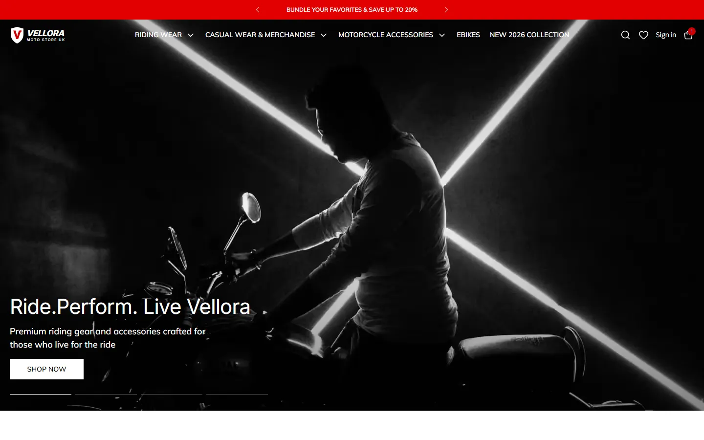
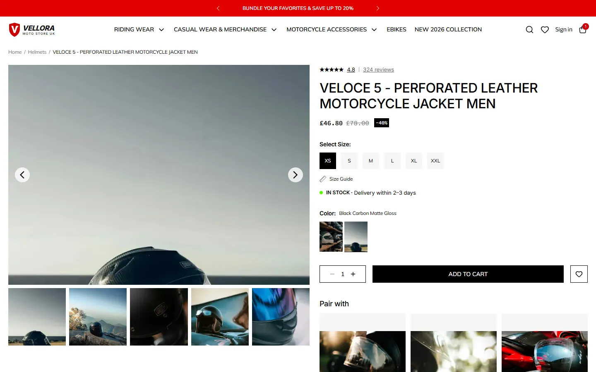
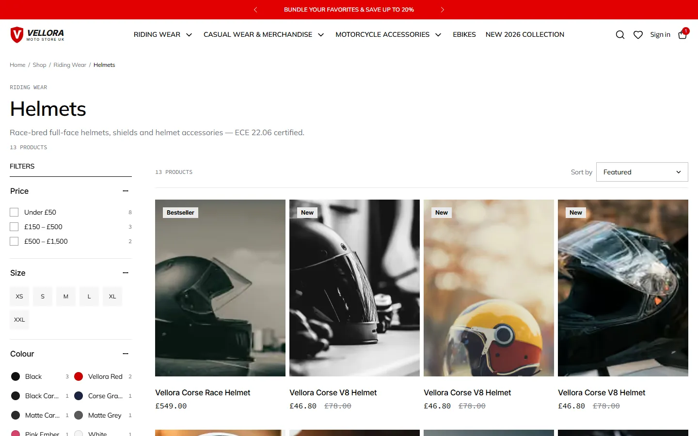
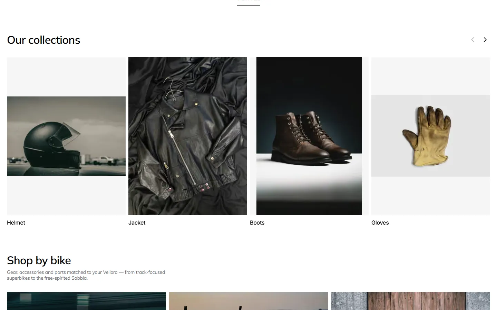
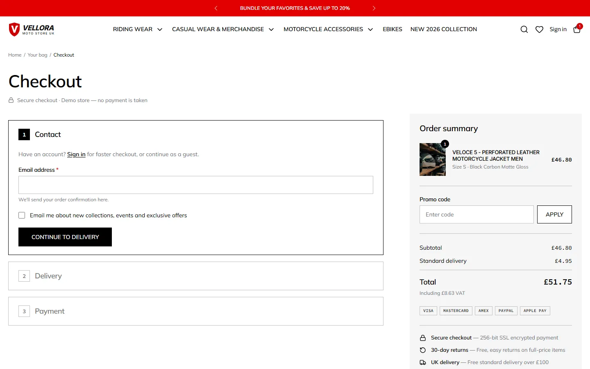
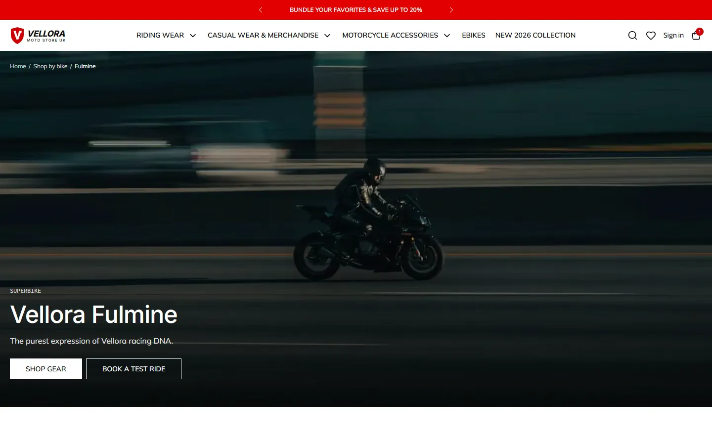
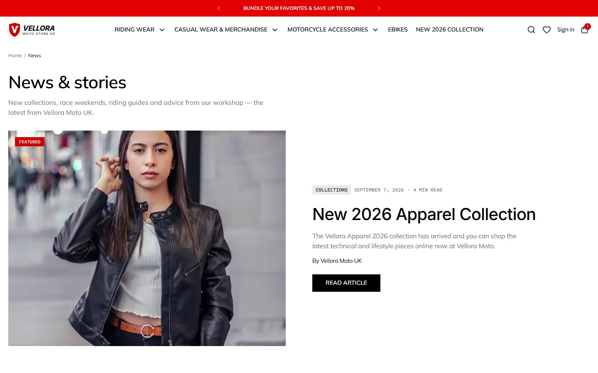

# Vellora Moto UK

A complete, production-style motorcycle e-commerce website for **Vellora Moto**, a fictional Italian-style motorcycle brand. It covers riding gear, lifestyle apparel, performance parts, eBikes, track days and servicing, and is built with **Next.js 16**, **React 19**, **Tailwind CSS v4** and **shadcn/ui**.

The home page, product page and cart drawer are pixel-matched to the original Figma design, and every other page extends the same design system.



---

## Table of contents

- [Features](#features)
- [Screenshots](#screenshots)
- [Tech stack](#tech-stack)
- [Getting started](#getting-started)
- [Pages & routes](#pages--routes)
- [Project structure](#project-structure)
- [How it works](#how-it-works)
- [Demo data & test values](#demo-data--test-values)
- [Design system](#design-system)
- [Performance](#performance)
- [SEO & accessibility](#seo--accessibility)
- [Going to production](#going-to-production)
- [Image credits](#image-credits)
- [Author](#author)

---

## Features

**Shopping**
- ~120 products across 15 categories and 4 departments, plus New 2026, Sale and Bestsellers collections
- Shop listing with search, filters (category, price, size, colour, bike, availability, sale, new), live option counts, removable filter chips, sorting and "Load more" pagination — all driven by the URL, so every filtered view is shareable
- Mobile "Filter & sort" sheet
- Instant site search (<kbd>Ctrl</kbd>/<kbd>⌘</kbd> + <kbd>K</kbd>) across products, categories, bikes and pages

**Product pages**
- Image gallery with thumbnails, colour variants that switch images, size selector, stock levels (in stock / low stock / sold out)
- Size-guide dialog per category, "Pair with" recommendations, related products and recently viewed
- Customer reviews with rating breakdown, search, sort, "Load more" and a working **Write a review** form
- Product JSON-LD for rich search results

**Cart & checkout**
- Slide-out cart drawer and full `/cart` page with promo codes and a free-delivery progress bar
- 3-step checkout (contact → delivery → payment) with step validation, saved addresses and shipping methods
- Orders are **re-priced on the server** — client-side prices are never trusted
- Order confirmation and order tracking with a status timeline

**Accounts & wishlist**
- Register / sign in / sign out, "Remember me", dashboard with orders (view, track, buy again), address book and profile / password settings
- Wishlist with shareable links, "Add all to bag" and recently viewed

**Content & experiences**
- Shop by bike: pages for the Fulmine, Rombo, Bestia, Orizzonte, Sabbia and Notturno model lines, with key figures, galleries (lightbox) and compatible parts
- eBikes landing page
- News journal with category filters and full articles
- Track-day booking, service & workshop booking, contact form with map, gift cards (buy + balance check), FAQ with search, size guide, and policy pages (shipping, returns, privacy, terms)
- Branded 404 and error pages

---

## Screenshots

| Product page | Shop |
| --- | --- |
|  |  |

| Collections | Checkout |
| --- | --- |
|  |  |

| Shop by bike | News |
| --- | --- |
|  |  |

---

## Tech stack

| Area | Technology |
| --- | --- |
| Framework | [Next.js 16](https://nextjs.org) (App Router, Turbopack, Server Components, Server Actions) |
| UI | React 19, [Tailwind CSS v4](https://tailwindcss.com), [shadcn/ui](https://ui.shadcn.com) on [Base UI](https://base-ui.com) |
| Carousels | [Embla Carousel](https://www.embla-carousel.com) |
| Validation | [Zod 4](https://zod.dev) |
| Toasts | [Sonner](https://sonner.emilkowal.ski) |
| Icons | [Lucide](https://lucide.dev), SVGs exported from the Figma design, and an inline SVG logo |
| Images | `next/image` with AVIF/WebP output; source photos pre-compressed to WebP with [sharp](https://sharp.pixelplumbing.com) |
| Fonts | Mulish, Inter, Source Code Pro, Anek Bangla, Urbanist (via `next/font`) |
| Language | TypeScript |

---

## Getting started

**Requirements:** Node.js 20.9 or newer.

```bash
git clone <this-repo-url>
cd <repo-folder>
npm install
npm run dev
```

Open [http://localhost:3000](http://localhost:3000).

| Script | What it does |
| --- | --- |
| `npm run dev` | Start the development server |
| `npm run build` | Create a production build (≈176 pre-rendered pages) |
| `npm start` | Serve the production build |
| `npm run lint` | Run ESLint |

No environment variables are required to run the site.

---

## Pages & routes

| Area | Routes |
| --- | --- |
| Home | `/` |
| Shop | `/shop`, `/shop?q=…`, `/shop/[slug]` — categories (`helmets`, `jackets`, `suits`, `gloves`, `boots`, `hoodies`, `t-shirts`, `polos`, `caps`, `bags`, `lifestyle`, `exhausts`, `performance`, `touring`, `ebikes`), departments (`riding-wear`, `casual-wear`, `accessories`) and collections (`new-2026`, `sale`, `bestsellers`) |
| Products | `/products/[slug]` |
| Bikes | `/bikes`, `/bikes/[model]`, `/ebikes` |
| Commerce | `/cart`, `/checkout`, `/checkout/success`, `/track-order`, `/wishlist` |
| Account | `/account/login`, `/account/register`, `/account` |
| Content | `/news`, `/news/[slug]`, `/about`, `/contact`, `/track-days`, `/service`, `/faq`, `/size-guide`, `/gift-cards` |
| Policies | `/shipping`, `/returns`, `/privacy`, `/terms` |
| SEO | `/sitemap.xml`, `/robots.txt`, `/manifest.webmanifest`, `/icon`, `/opengraph-image` |

Shop filters are URL parameters, for example:

```
/shop/jackets?size=M&color=Black&sort=price-asc
/shop/accessories?bike=fulmine
/shop?q=helmet&price=150-500
```

---

## Project structure

```
src/
├── app/
│   ├── page.tsx                 # Home page
│   ├── layout.tsx               # Root layout: fonts, cart provider, toaster
│   ├── actions.ts               # Server actions (forms + order placement)
│   ├── not-found.tsx            # Branded 404
│   ├── sitemap.ts, robots.ts, manifest.ts, icon.tsx, opengraph-image.tsx
│   └── (store)/                 # Pages sharing the header/footer layout
│       ├── shop/, products/, bikes/, ebikes/
│       ├── cart/, checkout/, track-order/, wishlist/, account/
│       └── news/, about/, contact/, track-days/, service/, faq/, …
├── components/
│   ├── ui/                      # shadcn/ui primitives
│   ├── layout/                  # Header, footer, announcement bar, newsletter
│   ├── home/, product/, shop/, checkout/, account/, news/, content/
│   ├── site/                    # Page header, breadcrumbs, forms, search
│   ├── brand/                   # Vellora logo (inline SVG)
│   └── icons.tsx                # Icons generated from the Figma SVGs
└── lib/
    ├── catalog.ts               # Products, categories, departments + helpers
    ├── site-content.ts          # Navigation, hero slides, collections, stories
    ├── format.ts                # Price formatting (kept tiny so it can ship to the client)
    ├── bikes.ts, news.ts, experiences.ts, size-guide.ts, reviews.ts
    ├── pricing.ts               # Shipping, VAT, promo codes, totals
    ├── search.ts                # Site search scoring
    ├── local-store.ts           # localStorage-backed external store
    └── cart-store.ts, wishlist-store.ts, account-store.ts
public/
└── media/                       # All photography, as optimised WebP files
```

---

## How it works

**Catalog data** lives in typed modules under `src/lib/` (`catalog.ts`, `bikes.ts`, `news.ts`, `experiences.ts`). Pages are statically generated from it with `generateStaticParams`, so product, bike and article pages are pre-rendered at build time.

**Shop filtering** runs on the server from `searchParams`. The client filter UI only updates the URL, which keeps results shareable and bookmarkable.

**Client state** — cart, wishlist, recently viewed, accounts, orders and user reviews — is stored in `localStorage` through a small `useSyncExternalStore` wrapper (`src/lib/local-store.ts`). It survives reloads, syncs between tabs and avoids hydration mismatches.

**Server actions** (`src/app/actions.ts`) validate every form with Zod: newsletter, contact, service booking, track-day booking and gift-card balance. `placeOrder` validates the order, checks stock and **recalculates every price from the catalog on the server** before creating the order.

**Pricing** (`src/lib/pricing.ts`) is shared by the UI and the server: shipping methods, free standard delivery over £100, VAT-inclusive totals and promo codes.

---

## Demo data & test values

This is a fully working front end with demo back-end behaviour:

| What | Value |
| --- | --- |
| Test card | `4242 4242 4242 4242`, any future expiry, any CVC |
| Promo codes | `RIDE10` (10% off), `VELLORA20` (20% off orders over £200), `FREESHIP` (free delivery) |
| Gift card balance | `VELLORA-GIFT-0001`, PIN `1234` |

- **No payment is ever taken.** The card number and CVC never leave the browser — only the card brand and last four digits are sent to the server.
- **Accounts are demo-only.** They are stored in the browser (passwords are SHA-256 hashed) — this is not a secure authentication system.
- Orders, reviews and accounts exist only in the browser that created them.

---

## Design system

- **Colours:** Vellora red `#e00000` / `#cc0001`, black, white, surface grey `#f5f5f5`, secondary text `#6b6e76`
- **Typography:** Mulish (body & headings), Inter (product names, hero headlines), Source Code Pro (prices & dates)
- **Shape:** square corners throughout, 20px page gutters, 80px section rhythm
- **Responsive:** tested from 375px phones to 1440px+ desktops, with a compact navigation for small laptops

Design tokens are defined in `src/app/globals.css`.

---

## Performance

The site is built to load fast on mobile:

- **Images:** all 209 images are stored as WebP in `public/media/`, capped at 1920px (wide banners) or 1200px (everything else). The whole set is about 18 MB, down from roughly 100 MB of original JPG/PNG. `next/image` then serves AVIF or WebP at the right width for each device, and the source files are served with a one-year immutable cache header.
- **LCP:** only the first hero slide is rendered and loaded eagerly with `fetchPriority="high"`. The other slides and the autoplay start after the visitor first interacts with the page.
- **JavaScript:** search, the mobile menu, the cart drawer and recently-viewed products are loaded with `React.lazy` the first time they are used. The product catalog never ships to the browser; product cards get only the fields they need.
- **Fonts:** loaded with `next/font`; secondary fonts aren't preloaded.
- **Navigation:** the desktop dropdown menus use CSS only, so they need no JavaScript.

Lighthouse (production build, run locally):

| Page | Performance (desktop) | Performance (mobile, simulated) | Accessibility | Best practices | SEO |
| --- | --- | --- | --- | --- | --- |
| Home | 99 | 73–81 | 100 | 100 | 100 |
| Product | 99 | 72–73 | 100 | 100 | 100 |
| Shop | 99 | 70–75 | 100 | 100 | 100 |
| Bike | 99 | 79 | 100 | 100 | 100 |
| News | 99 | 74–93 | 100 | 100 | 100 |

Ranges are from repeated runs. Mobile scores use Lighthouse's simulated slow-4G throttling on localhost and are mostly limited by the React/Next.js runtime; hosted on a CDN (e.g. Vercel), real-world numbers are typically higher.

---

## SEO & accessibility

- Per-page metadata and Open Graph images, dynamic sitemap, robots rules and web manifest
- JSON-LD structured data for products, articles and FAQs
- Semantic HTML, labelled form fields with accessible error messages, keyboard-navigable menus, dialogs and carousels, visible focus states and `prefers-reduced-motion` support

---

## Going to production

To turn the demo into a live store, replace the browser-only pieces with real services:

1. **Authentication** — e.g. Auth.js, Clerk or Supabase Auth instead of `account-store.ts`
2. **Database** — persist products, orders, reviews and addresses (e.g. PostgreSQL with Prisma or Drizzle)
3. **Payments** — Stripe or Adyen in the checkout payment step
4. **Email** — send contact, booking and order confirmations (e.g. Resend or Postmark)
5. **Content** — review placeholder copy (stories, articles, team, policies) before launch

---

## Image credits

All photography comes from [Unsplash](https://unsplash.com) under the [Unsplash License](https://unsplash.com/license), and every photographer is credited in [IMAGE_CREDITS.md](IMAGE_CREDITS.md). Icons were exported from the project's Figma design.

**Vellora Moto is a fictional brand** created for this portfolio project. All product names, model names, prices and stories are made up. Any real vehicles or products that appear in the stock photos are incidental; this project isn't affiliated with or endorsed by any motorcycle manufacturer.

---

## Author

**Rehan Ali** — [@igrehanali](https://github.com/igrehanali)
